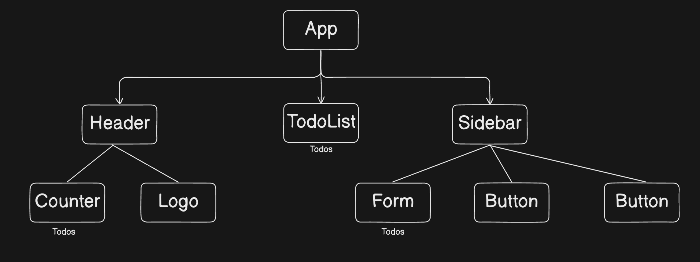
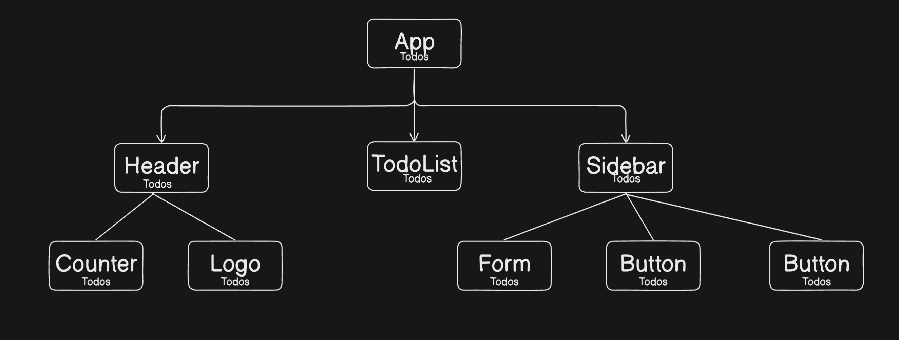

# React + TypeScript + Vite

This template provides a minimal setup to get React working in Vite with HMR and some ESLint rules.

Currently, two official plugins are available:

- [@vitejs/plugin-react](https://github.com/vitejs/vite-plugin-react/blob/main/packages/plugin-react/README.md) uses [Babel](https://babeljs.io/) for Fast Refresh
- [@vitejs/plugin-react-swc](https://github.com/vitejs/vite-plugin-react-swc) uses [SWC](https://swc.rs/) for Fast Refresh

## Expanding the ESLint configuration

If you are developing a production application, we recommend updating the configuration to enable type aware lint rules:

- Configure the top-level `parserOptions` property like this:

```js
export default {
  // other rules...
  parserOptions: {
    ecmaVersion: 'latest',
    sourceType: 'module',
    project: ['./tsconfig.json', './tsconfig.node.json'],
    tsconfigRootDir: __dirname,
  },
}
```

- Replace `plugin:@typescript-eslint/recommended` to `plugin:@typescript-eslint/recommended-type-checked` or `plugin:@typescript-eslint/strict-type-checked`
- Optionally add `plugin:@typescript-eslint/stylistic-type-checked`
- Install [eslint-plugin-react](https://github.com/jsx-eslint/eslint-plugin-react) and add `plugin:react/recommended` & `plugin:react/jsx-runtime` to the `extends` list

### React Terminologies : 

1. **Components :** A component in React is just an independent peice of the overall appication. A component is just a JavaScript function which returns html.

**Note :** An UI is a composition(collection) of components.

2. **Lifting the state :** Moving the state from a component to it's common ancestor, so that the state can be accessed by it's sibbling component as well

**Example :**

 

- Here in the above image, a state i.e "Todos", present in "TodoList" component, needs to be used in different components like, "Counter" and "Form" component as well.

- Since the "Todos" state cannot be shared between the sibbling components of "TodoList", i.e "Header" and "Sidebar" component.

- We need to lift the "Todos" state up into it's parent component i.e "App" component, so that the "Todos" state can be passed down to it's children components i.e "Header", "TodoList" and "Sidebar" component.

 